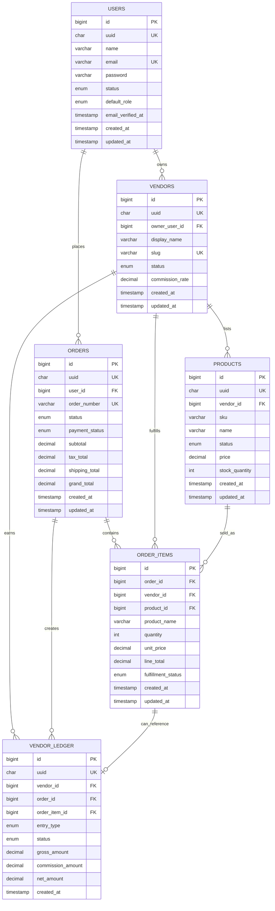

# Phase 1 - Entity Relationship Model

Template: Mega Marketplace
Database: MySQL

## Core ER Diagram

## Relationship Rules

- One user can own zero or many vendors.
- One vendor owns many products.
- One customer user places many orders.
- One order contains many order items.
- Every order item belongs to exactly one vendor.
- One checkout can produce one parent order with multiple vendor-specific order items.
- Vendor ledger entries are generated from orders and/or order items.
- Ledger entries are append-only. Do not update financial history; add reversal entries when needed.

## Normalization Decisions

- Product name, SKU, and unit price are copied into `order_items` at purchase time.
  This preserves historical order accuracy if the product changes later.
- `vendor_ledger` stores gross, commission, and net amounts per vendor.
  This avoids recalculating historical payouts from mutable product/order data.
- `orders` is customer-facing. Vendor fulfillment is tracked at `order_items`.
  In Phase 3 we can optionally add `vendor_orders` if we need separate vendor order numbers.

## Important Future Tables

These are intentionally not part of the Phase 1 minimum schema, but should be added later:

- carts
- cart_items
- product_images
- product_categories
- product_variants
- vendor_payouts
- addresses
- payments
- refunds
- reviews
- audit_logs
- roles / permissions if we outgrow simple role fields
